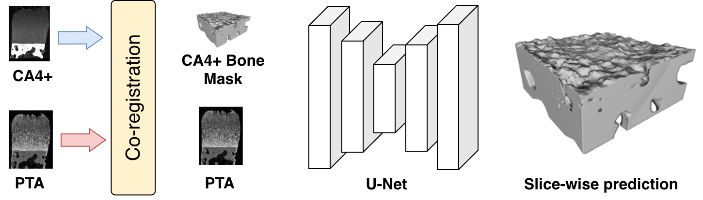
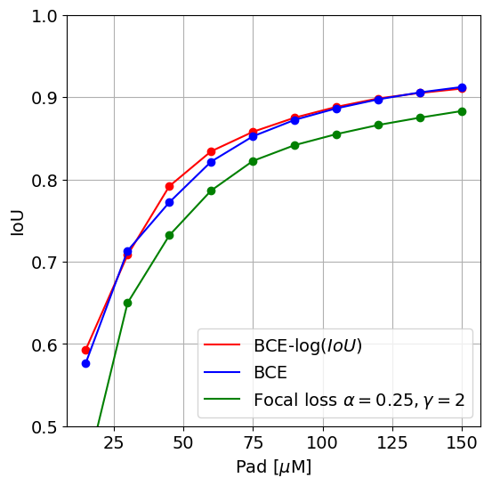
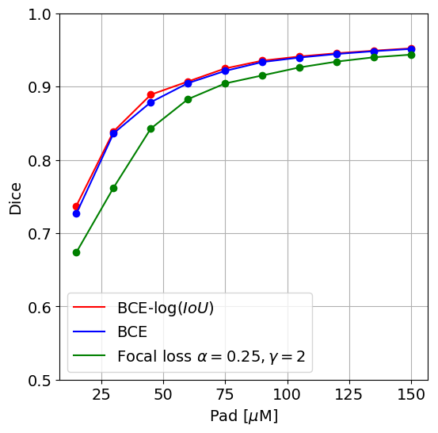
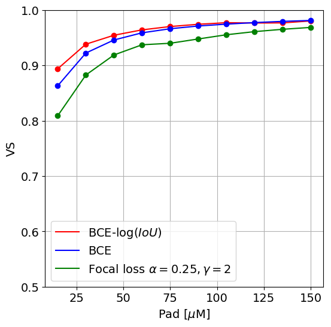

# Deep-Learning for Tidemark Segmentation in Human Osteochondral Tissues Imaged with Micro-computed Tomography

The codes and the dataset.

OpenReview submission to MICCAI 2019 COMPAY workshop: https://openreview.net/forum?id=SJxFegjX-r.

ArXiv pre-print: https://arxiv.org/abs/1907.05089

(c) Aleksei Tiulpin, University of Oulu, 2019.

## TL;DR;
In this paper we introduced a new dataset for biomedical image segmentation. We tackled the problem of 
segmenting tidemark in human ostechondral samples stained with PTA contrast agent. We imaged the samples
with two different contrast agents (PTA and CA4+) and eventually co-registered the imaging results. 

The method described above allowed us to obtain the calcified tissue masks as it is well visible in CA4+ in contrast to PTA.
We used U-Net with minor modifications and benchmarked several loss functions: cross entropy, 
focal loss, soft-Jaccard loss and also the soft-Jaccard loss combined with cross-entropy.

<center>

</center>

## Codes
### Installation
You need to install my mono-repository that enables binary segmentation possible.
Use the line below that creates a conda environment and fetches all the necessary dependencies
from `pip` and `conda`:

```
conda env create -f pta_segmentation.yml
```

### Dataset
You can use the script `download_data.sh` to get the dataset. It will also be downloaded automatically by the training 
script.

### Training
The script below will download the data, execute the experiments (it will take several days on 3xGTX1080Ti) 
and eventually generate the result pictures presented below. 

```
sh run_experiments.sh
```


### Results
At the end of the script's execution, somewhat similar pictures (as in the paper) will be stored
in the folder `pics`.

<table style="width:100%">
  <tr>
    <td> </td>
    <td></td>
    <td></td>  
  </tr>
  <tr>
    <td align="center">IoU</td>
    <td align="center">Dice</td>
    <td align="center">Volumetric Similarity</td>
  </tr>
</table>

## Citing this work
To use this dataset in your work, please, refer to our pre-print (for now):
```
@misc{1907.05089,
  Author = {Aleksei Tiulpin and Mikko Finnilä and Petri Lehenkari and Heikki J. Nieminen and Simo Saarakkala},
  Title = {Deep-Learning for Tidemark Segmentation in Human Osteochondral Tissues Imaged with Micro-computed Tomography},
  Year = {2019},
  Eprint = {arXiv:1907.05089},
}
```
